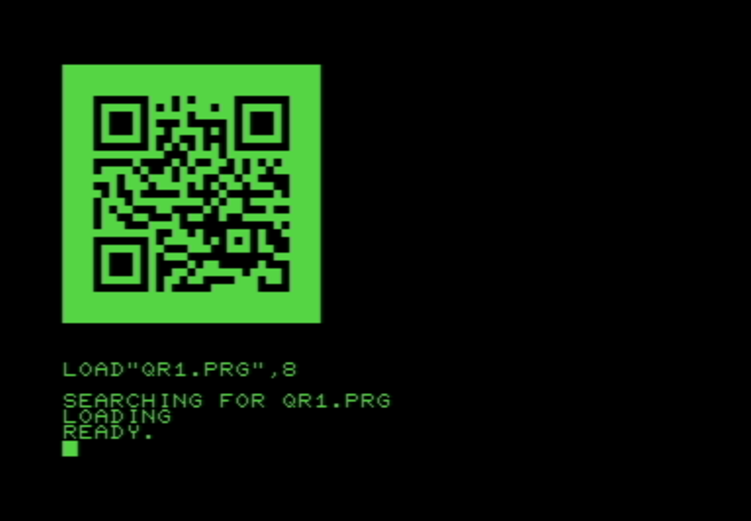

# CBM-QR

## Script to generate a loadable QR code for Commodore PET using PETSCII quarter-block graphics

First, generate the graphic asset with your desired QR contents

```$ ./petqr.sh "random string for testing" >qr1.prg```

Then transfer the output, qr1.prg in this case, to your PET or PET emulator.

Once in your PET environment, you can use the loader program or directly load the QR code right to screen memory

### BASIC 3
```
LOAD"QR1.PRG",8
```

-or-

```
LOAD"PETQRLOADER",8
RUN
```

### BASIC 4
```
DLOAD"QR1.PRG"
```

-or-

```
DLOAD"PETQRLOADER"
RUN
```

