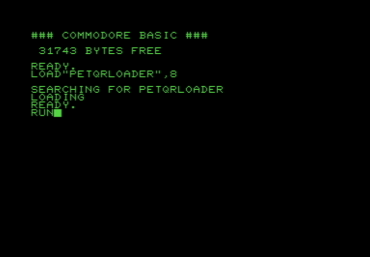
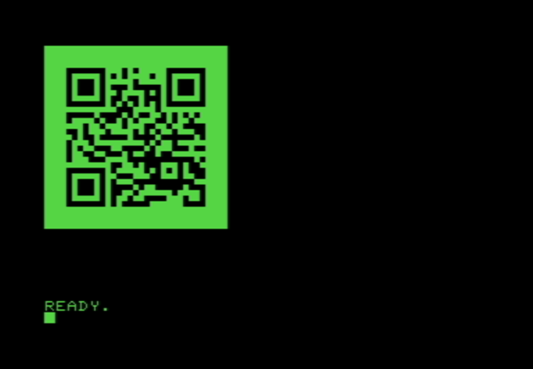
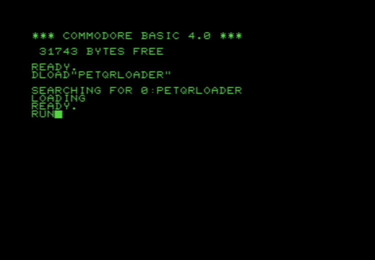
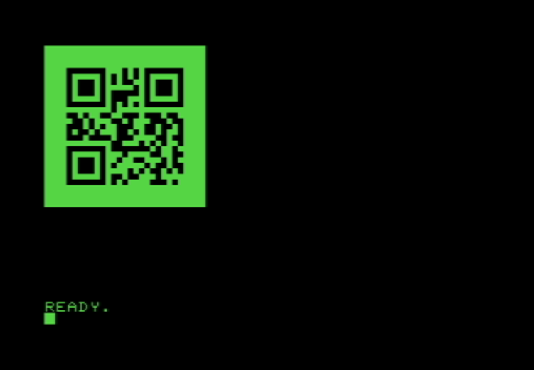

# CBM-QR

## Script to generate a loadable QR code for Commodore PET using PETSCII quarter-block graphics

Since generating QR codes is somewhat difficult in 6502 assembly, I thought I'd take a stab at using modern tools to generate the codes and emit them in an easily loadable format for Commodore machines (starting with the PET).

## Prerequisites

- Perl and Bash
- qrencode

## Instructions

First, generate the graphic asset with your desired QR contents

```
$ ./petqr.sh "random string for testing" >qr1.prg
```

Then transfer the output, qr1.prg in this case, to your PET or PET emulator.

Once in your PET environment, you can use the loader program or directly load the QR code right to screen memory

### BASIC 3
```
LOAD"QR1.PRG",8
```

-or-

```
LOAD"PETQRLOADER",8
RUN
```



### BASIC 4
```
DLOAD"QR1.PRG"
```

-or-

```
DLOAD"PETQRLOADER"
RUN
```



## Future Enhancements

- Optionally centering the output
- Support for VIC-20 (22x23 screen size plus colors)
- Support for Commodore 64/SX-64/Commodore 128 (colors)
- Support for 80-column PET